# Rainbow ToDo's

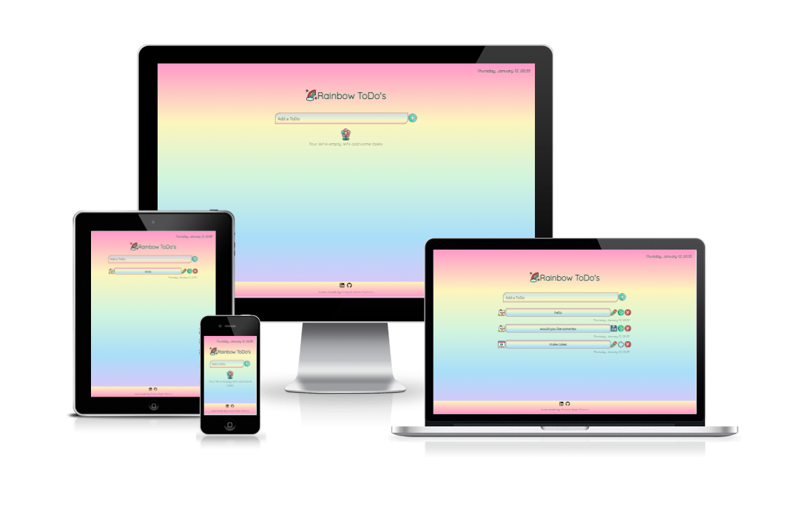

#### [**Live Website**](https://noemichis.github.io/rainbow-todos/)

A simple and colorful ToDo List project to organize daily tasks. It is created to be responsive on all screen sizes so users can easily access it from anywhere and offers control buttons for easy and intuitive interaction. 

## User goals 

- Quickly understand the purpose of the site.
- Easily interact with the page: 
    - add tasks.
    - update tasks.
    - mark tasks complete.
    - delete tasks when no longer applicable.
- Keep track of time.
- Enjoy the design and colors to boost the day.

## Design

I wanted the site to be simple, easy to use, but colorful, happy and lively as for me these are the main characteristics I usually look for in a product. 

The colors were chosen with the color pallette generator [Coolors](https://coolors.co). Once I had the colors I used a linear-gradient CSS function to create a rainbow-like effect. 

Fonts used in the project were `Quicksand` for the heading and time objects, `Source Sans Pro` for the body of the page, both having a sans-serif font as backup. They were imported from [Google Fonts](http://fonts.google.com).

The icons are sourced from [Flaticon](https://www.flaticon.com/) and were made by [Freepik](https://www.freepik.com/) in a lineal color style, which gives them a playful appearance. 

## Features

All features of the page are fully responsive and adjust well for all screen sizes, from extra small mobiles to large monitors and their functionality has been tested.

### Landing page
- Add an input task, where the submit button calls the function and creates the tasks. 
- An empty state message, which indicates that no ToDo's have been added yet. This element is hidden when a task is added, then called back when all tasks have been closed. 
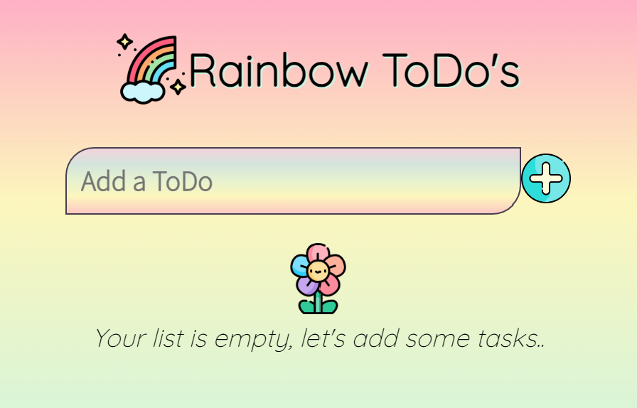
- The input element has validation alert and will prevent the user from submitting empty fields or input that only contains blank spaces. To make this alert prettier, [SweetAlert](https://sweetalert.js.org/guides/) was used.
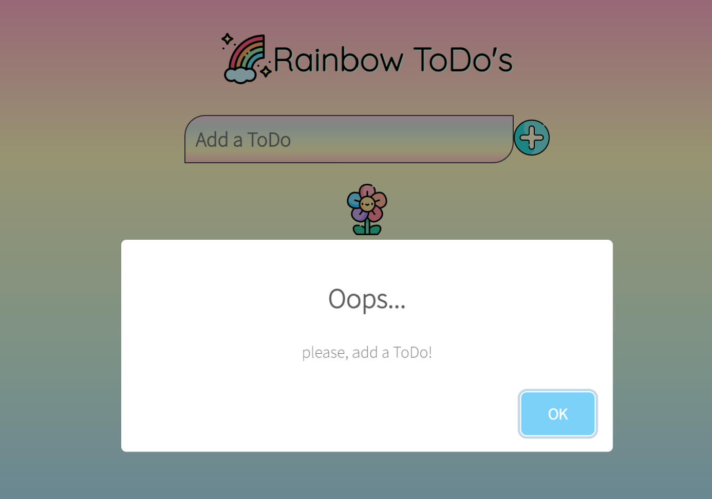
- For better user experience the input field changes on hover and when active.

- The submit button has a bounce on hover effect attributed, same as all the other button elements on the page. 

### ToDo list items
- Adding multiple elements with initial state and timestamp
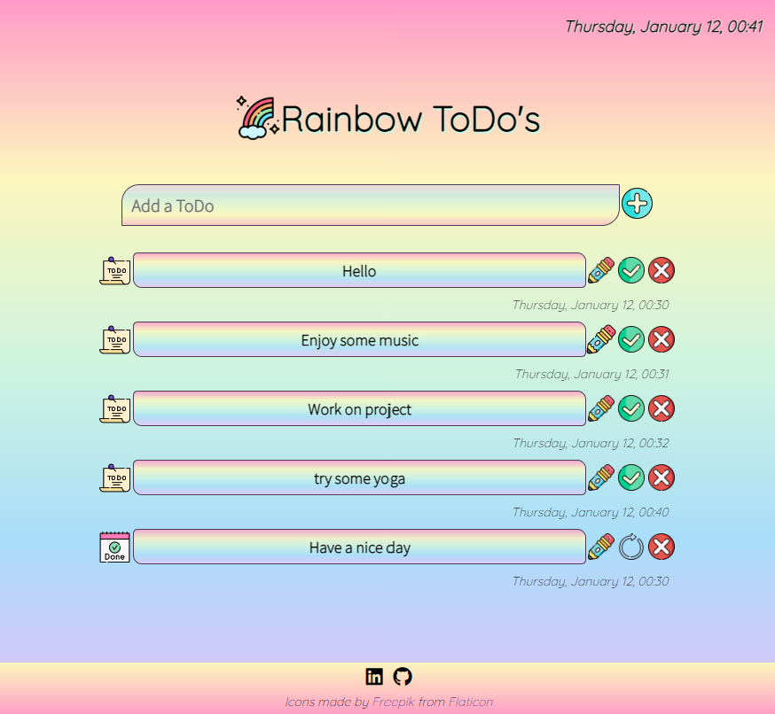
- **ToDo** and **Done** icons in front of the input visually indicate if a task is complete or not.
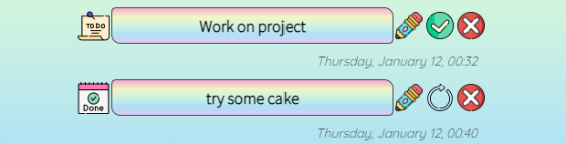

### Buttons
- *Edit* and *Save* buttons
    - On click calls an event to modify the input and changes the class so it serves the save button. For more visual representation the pencil is switched to a save icon.
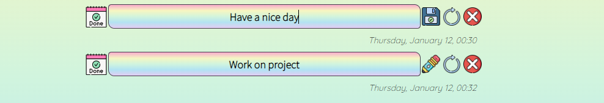 
    - Once the editing is complete, clicking on the save icon will call the edit button back and switch the icons as well.

- *Check* and  *Reopen* buttons
    - The check button marks the task complete by moving it to the end of the list and replacing it's class, along with the representative icon. 
    - This step can also be reverted by clicking on the reopen icon, which will re-append the task to the tasks that aren't yet completed.

- *Delete button*
    - As mistakes happen, this button is also needed and will remove the task from the list. If there are no more tasks the empty state message will pop back up on the screen. 

### Clock
- As an extra feature a simple form of the current date and updating time is displayed on the top-right of the screen.
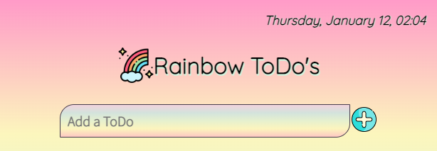

### Footer
- The footer contains the social media links that open in a new tab and have hover effect, noticeable in the image below.

- Attribute the author of the icons with external links. 

## Features to add 

- Add confirmation for delete button
- Add local or cloud storage
- Add a welcome section, like *"Happy Wednesday, what's for today?"*
- Add filters for existent tasks  

## Testing

### Automated testing

- HTML tested with [W3C Markup validation Service](https://validator.w3.org/)
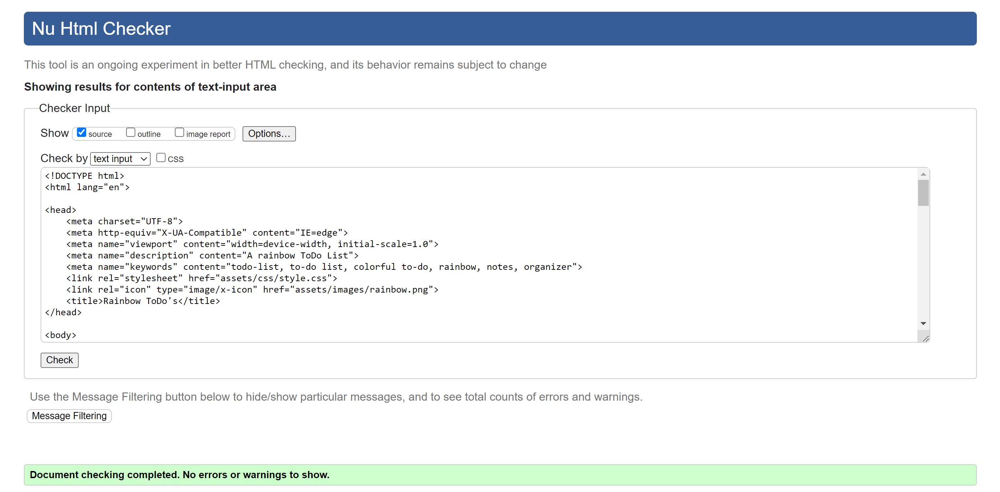

- CSS tested with [The W3C CSS Validation Service](https://jigsaw.w3.org/)
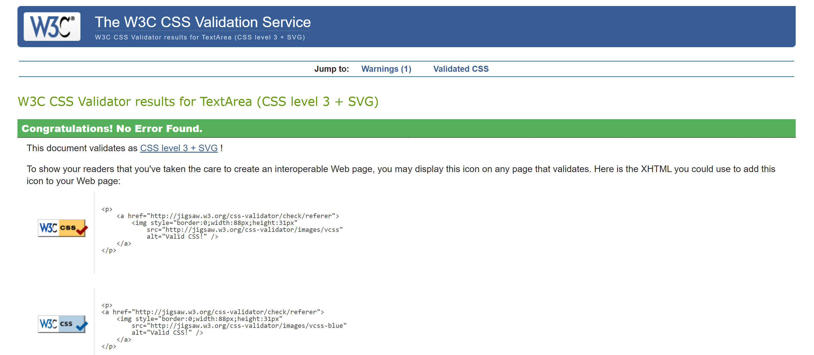 

- For the JavaScript code [JSHint](https://jshint.com/) was used. To mention that the warnings are because the programme does not support ES6.
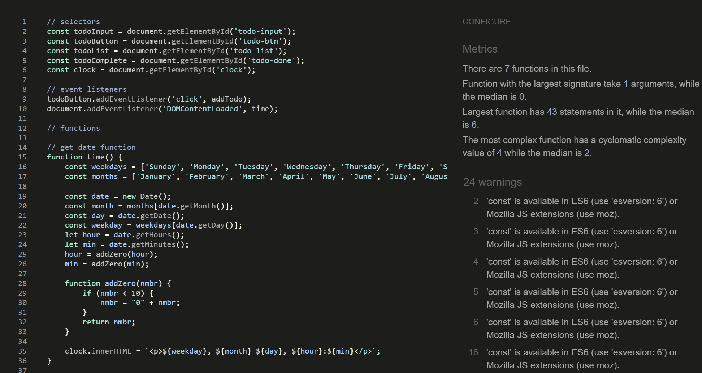

- [Lighthouse](https://developer.chrome.com/docs/lighthouse/overview/) for checking accessibility scores.
#### Mobile report 
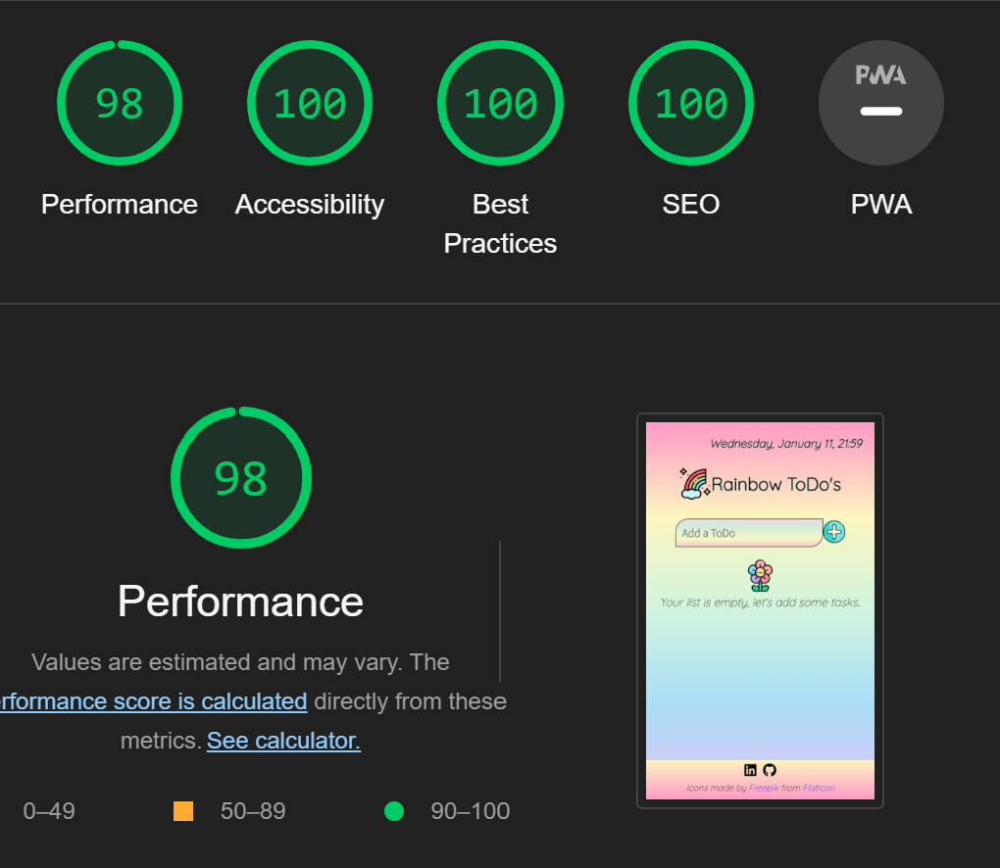
#### Desktop report
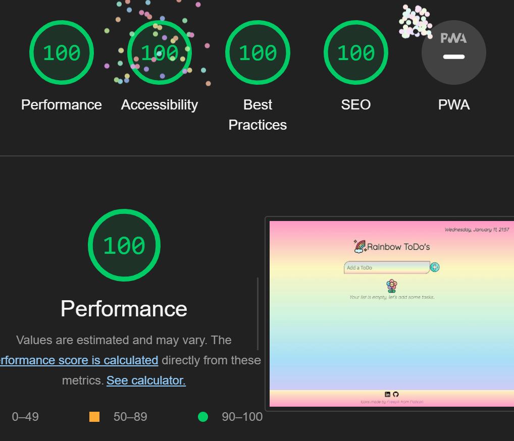

- [Code Spell Checker](https://open-vsx.org/extension/streetsidesoftware/code-spell-checker) extension was used along development

### Manual testing

- Responsiveness tested with [Chrome Dev Tools](https://developer.chrome.com/docs/devtools) and verified on different size mobiles, laptops and large monitors.
- Browser compatibility tested in: Google Chrome, Mozzilla Firefox, Microsoft Edge and Brave with no resulting issues. 
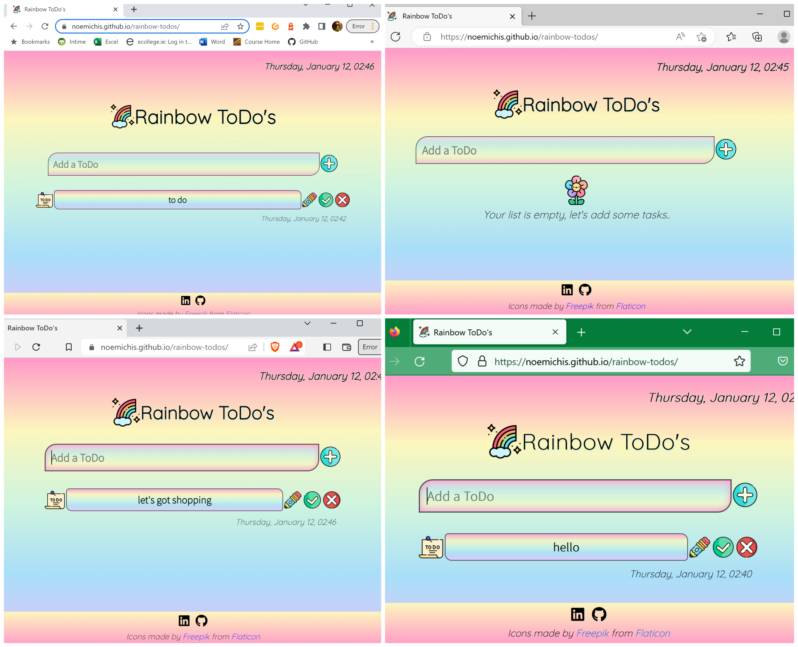
- Social media links open in a new tab, tested multiple times by opening them at different times.
- All JavaScript code was tested with the log function in DevTools console.
- Empty state message tested by adding and removing list items. 
- Input field thoroughly tested by adding multiple ToDo's.
- Input validation and SweetAlert test was carried out by trying to submit fields that are empty or with blank spaces. 
- Buttons functionality was tried by clicking them over and over to ensure they have no errors.
- The time and date feature initially tested with console.log, then monitoring the change of minutes. For more accurate results I tested the time with seconds included and removed them afterwards.
- Timestamp accuracy tested by adding multiple inputs and observing the time.

### Bugs

#### Resolved

1. Initially the validation was not thorough and blank spaces could be submitted:
    - adjust if statement for stricter checking.

2. Input field wasn't responsive after some adjustments:
    - add flex properties to the parent. 

3. Time was only updating on window refresh:
    - setTimeout function helped to resolve the issue and time is updating correctly. Possibly will look into another way!

4. Empty State message was not called back after deleting all tasks:
    - if cause added to the delete function

#### Unresolved

1. Edit button bounce effect gets stuck after modifying and saving the input. After clicking anywhere else on the page is back to normal:
    - possible cause could be the way I created the pair of buttons, but it does not affect the other pair.

## Deployment

The project was developed and deployed through [GitHub](https://github.com), using [Gitpod](https://gitpod.io) as development platform and [VSCode](https://code.visualstudio.com/) as the default code editor. 

The following *`git commands`* were used to commit and push the changes to the repository: 
- **git status** - list changes to files
- **git add** - add modified files to staging  area
- **git commit** - explain changes made to files
- **git push**  - push all files from staging area to main **Github** repository

[GitHub Pages](https://pages.github.com/) was used to deploy the project with the following steps:
1. Log into **Github** and open project repository
3. Navigate to `Settings`
4. Find and click on `Pages` in the left-hand side menu
5. Under `Source` select `Deploy from branch` 
6. Click the dropdown menu under `Branch` and select `main` and **Save**
8. Refresh the page and find link to deployed project at the top

## Technology and resources

- [HTML5](https://en.wikipedia.org/wiki/HTML5)
- [CSS](https://en.wikipedia.org/wiki/CSS)
- [JavaScript](https://www.javascript.com/)
- [SweetAlert](https://sweetalert.js.org/guides/) - used to make alert prettier
- [Github](https://github.com) - create, develop and deploy project
- [Gitpod](https://gitpod.io) - used as remote development platform to write and test code
- [Google Fonts](http://fonts.google.com) - online font library 
- [Coolors](https://coolors.co) - color palette generator used to identify the colors of the hero image and create a matching combination
- [Flaticon](https://www.flaticon.com/) - source for the icons used across the page
- [Fontawesome](https://fontawesome.com) - online icons used for the social media links
- [Chrome Dev Tools](https://developer.chrome.com/docs/devtools) - great tool for checking responsiveness on different screen sizes, making test changes and troubleshooting 
- [Figma](https://www.figma.com) - design tool
- [Lighthouse](https://developer.chrome.com/docs/lighthouse/overview/)
- [W3C Markup validation Service](https://validator.w3.org/)
- [The W3C CSS Validation Service](https://jigsaw.w3.org/)
- [JSHint](https://jshint.com/)
- [Am I Responsive](https://ui.dev/) - tool to check responsiveness on various screens simultaneously 

## Credits

I used several sites to understand the logic behind JavaScript, as:
- [Code Institute Program](https://codeinstitute.net/)
- [MDN](https://developer.mozilla.org/en-US/) 
- [CSS-tricks](https://css-tricks) 
- [Stack Overflow](https://stackoverflow.com/)
- [JavaScript in Plain English](https://javascript.plainenglish.io/)
- [freeCodeCamp](https://www.freecodecamp.org/)
- [CodePen](https://codepen.io/)

Also, I watched many YouTube videos, analyzed various to-do projects and used the combined knowledge:
- [Developed By Ed](https://www.youtube.com/watch?v=Ttf3CEsEwMQ&ab_channel=developedbyed) - base design of the project
- [Todo List Application by Chris Sun](https://codepad.co/snippet/todo-list-application) - creating and appending DOM elements
- [CodeExplained](https://www.youtube.com/watch?v=i1pxPSl9ZHc&ab_channel=CodeExplained) - functions and events
- [W3Schools](https://www.w3schools.com) - javascript clock

- [Ian Lunn](https://ianlunn.co.uk/articles/hover-css-tutorial-introduction) - CSS code for bounce on hover effect

## Acknowledgements 

- Big thanks to my mentor, Jubril for all the great suggestions and support.