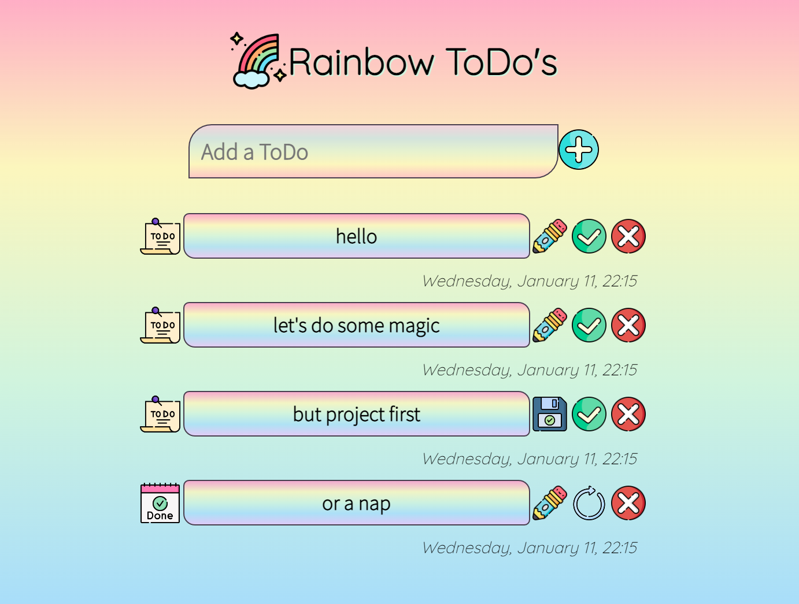

# Rainbow ToDo's

#### [**Live Website**](https://noemichis.github.io/rainbow-todos/)

A simple and colorful ToDo List project to organize daily tasks. It is created to be responsive on all screen sizes so users can easily access it from anywhere and offers control buttons for easy and intuitive interaction. 

## User goals 

- Quickly understand the purpose of the site.
- Easily interact with the page: 
    - add tasks.
    - update tasks.
    - mark tasks complete.
    - delete tasks when no longer applicable.
- Enjoy the design and colors to boost the day.

## Design

I wanted the site to be simple, easy to use, but colorful, happy and lively as for me these are the main characteristics I usually look for in a product. 

The colors were chosen with the color pallette generator [Coolors](https://coolors.co). Once I had the colors I used a linear-gradient CSS function to create a rainbow-like effect. 

Fonts used in the project were `Quicksand` for the main heading and `Source Sans Pro` for the body of the page, both having a sans-serif font as backup. They were imported from [Google Fonts](http://fonts.google.com).

The icons are sourced from [Flaticon](https://www.flaticon.com/) and were made by [Freepik](https://www.freepik.com/) in a lineal color style, which gives them a playful appearance. 

## Features

## Features to add 

- Add local or cloud storage

## Testing

### Automated testing

### Manual testing

### Bugs

## Deployment

The project was developed and deployed through [GitHub](https://github.com), using [Gitpod](https://gitpod.io) as development platform and [VSCode](https://code.visualstudio.com/) as the default code editor. 

The following *`git commands`* were used to commit and push the changes to the repository: 
- **git status** - list changes to files
- **git add** - add modified files to staging  area
- **git commit** - explain changes made to files
- **git push**  - push all files from staging area to main **Github** repository

[GitHub Pages](https://pages.github.com/) was used to deploy the project with the following steps:
1. Log into **Github** and open project repository
3. Navigate to `Settings`
4. Find and click on `Pages` in the left-hand side menu
5. Under `Source` select `Deploy from branch` 
6. Click the dropdown menu under `Branch` and select `main` and **Save**
8. Refresh the page and find link to deployed project at the top

## Technology and resources

- [HTML5](https://en.wikipedia.org/wiki/HTML5)
- [CSS](https://en.wikipedia.org/wiki/CSS)
- [JavaScript](https://www.javascript.com/)
- [SweetAlert](https://sweetalert.js.org/guides/) - used to make alert prettier
- [Github](https://github.com) - create, develop and deploy project
- [Gitpod](https://gitpod.io) - used as remote development platform to write and test code
- [Google Fonts](http://fonts.google.com) - online font library 
- [Coolors](https://coolors.co) - color palette generator used to identify the colors of the hero image and create a matching combination
- [Flaticon](https://www.flaticon.com/) - source for the icons used across the page
- [Fontawesome](https://fontawesome.com) - online icons used for the social media links
- [Chrome Dev Tools](https://developer.chrome.com/docs/devtools) - great tool for checking responsiveness on different screen sizes, making test changes and troubleshooting 
- [Figma](https://www.figma.com) - design tool
- [Lighthouse](https://developer.chrome.com/docs/lighthouse/overview/)
- [W3C Markup validation Service](https://validator.w3.org/)
- [The W3C CSS Validation Service](https://jigsaw.w3.org/)
- [JSHint](https://jshint.com/)
- [Am I Responsive](https://ui.dev/) - tool to check responsiveness on various screens simultaneously 

## Credits

I used several sites to understand the logic behind JavaScript, as:
- [Code Institute Program](https://codeinstitute.net/)
- [W3Schools](https://www.w3schools.com)
- [MDN](https://developer.mozilla.org/en-US/) 
- [CSS-tricks](https://css-tricks) 
- [Stack Overflow](https://stackoverflow.com/)

Also, I watched many YouTube videos, analyzed various to-do projects and combined some ideas:
- [Developed By Ed](https://www.youtube.com/watch?v=Ttf3CEsEwMQ&ab_channel=developedbyed) - Main frame of the project
- [Todo List Application by Chris Sun](https://codepad.co/snippet/todo-list-application) - creating and appending DOM elements

[Ian Lunn](https://ianlunn.co.uk/articles/hover-css-tutorial-introduction) - CSS code for bounce on hover effect

## Acknowledgements 

- Big thanks to my mentor, Jubril for all the great suggestions and support.